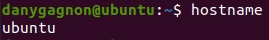
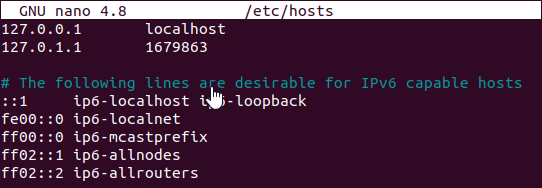
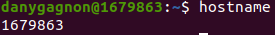
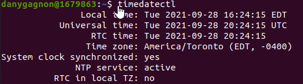
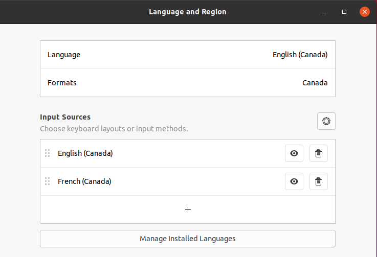
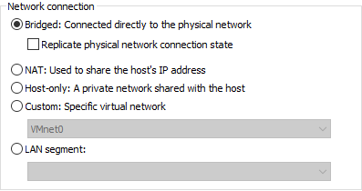

# Devoir semaine 4
**Auteur**: Dany Gagnon

## Créer une machine virtuelle
0. Le liens pour télécharger [Ubuntu 20.04.3](https://ubuntu.com/download/desktop/thank-you?version=20.04.3&architecture=amd64) (iso)
1. Pour créer la VM, il faut ouvrir le programme VMWare Workstation Pro.
2. `CTRL + N` pour créer une nouvelle VM.
3. Ensuite on clique next, next next, choisis le ISO ubuntu 20.04.3
4. Le easy install prompt, choisir un username, mots de passe


*Figure 1 - Capture d'écran pour le nom de l'utilisateur Linux*

5. J'ai choisis **20GB** `multiple files`
6. Ubuntu va démarrer, simplement attendre la fin de la création de la machine virtuelle.


*Figure 2 - Capture d'écran pour l'installation Linux*

**ps**: `CTRL + ALT` permet de sortir de la VM

7. Login sur le compte
8. Skip, next, next, don't send info, next, next, done.
9. Enlever les applications inutiles dans la barre des favoris.

## Faire les mises à jour
Pour faire les mises à jour du système, il faut faire un update et faire un upgrade.

```console
    # apt update && apt upgrade
```


*Figure 3 - Capture d'écran qui montre la commande pour effectuer les mises à jours*

```console
    $ shutdown -h now
```

## Faire un snapshot
Pour faire un snapshot, il faut s'assurer que la machine virtuelle est fermé pour éviter de faire un snapshot live.

1. Dans le menu de la VM, il faut aller dans `Take Snapshot...`


*Figure 4 - Capture d'écran qui montre le menu pour prendre le snapshot*


*Figure 5 - Capture d'écran qui montre que le snapshot a bien été pris*

## Configurer la machine

### Hostname
Pour vérifier le hostname, on utilise la commande

```console
    $ hostname
```



*Figure 6 - Capture d'écran pour montrer le hostname par défaut*

Par défaut, le hostname d'une nouvelle machine virtuelle est ubuntu. On va changer ça pour mon DA: 1679863

1. On va modifier le fichier hostname dans /etc

```console
    # nano /etc/hostname
```

**ps**: `CTRL + S` pour enregistrer et `CTRL + X` pour quitter nano

2. On va modifier le fichier hosts dans /etc pour changer l'ancien hostname pour le nouveau.

```console
    # nano /etc/hosts
```



*Figure 7 - Capture pour montrer mon fichier /etc/hosts*

3. Ensuite reboot la machine en utilisant la commande

```console
    $ reboot
```

**Maintenant, le hostname est changé pour 1679863**



*Figure 8 - Preuve du nouveau hostname*

### Fuseau horaire
Pour changer le fuseau horaire, on va utiliser la commande
```console
    $ timedatectl set-timezone America/Toronto
```

Ensuite pour vérifier les changement on va utiliser la commande

```console
    $ timedatectl
```



*Figure 9 - S'assurer que le timezone correspond au notre*

### Disposition du clavier
Pour la disposition et les autres paramètres, j'aime bien avoir deux clavers, un en anglais et l'autre en français pour les accents.
Je me suis habituer à changer mon clavier quand j'ai besoin de faire des accents avec les touches de raccourcis. On s'assure de mettre le format
et le pays pour le **Canada**



*Figure 10 - Ma configuration de clavier, language et region*

## Configurer le mode pont (bridge)

Se connecter sur directement au network physique



*Figure 11 - Configuration du mode pont sur l'application VMWare*

## Installer et configurer le serveur SSH