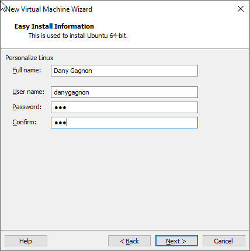
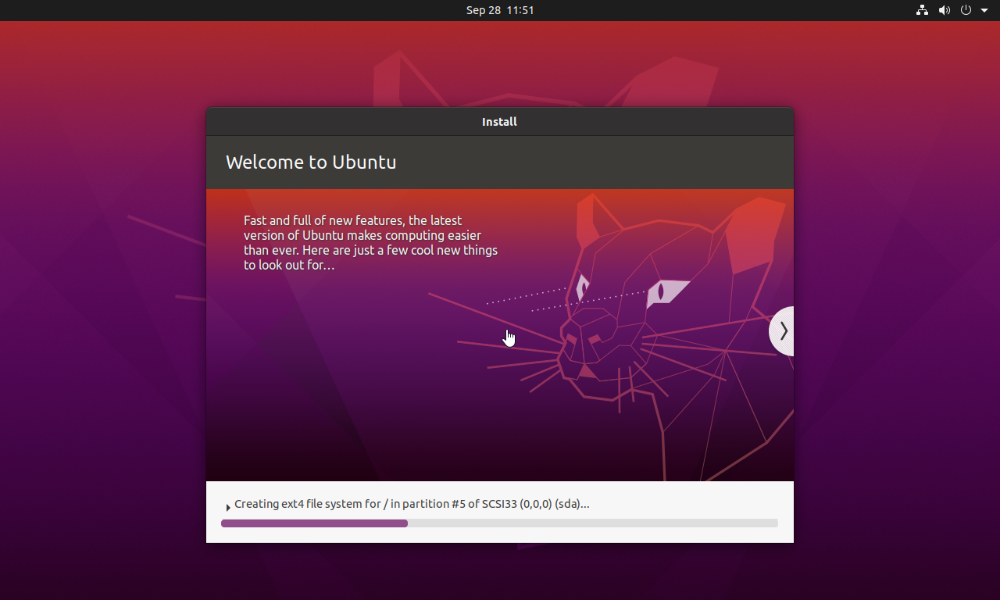
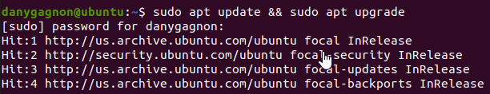
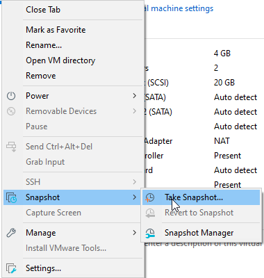
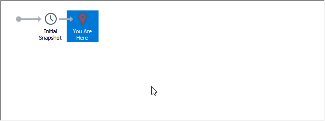

# Devoir semaine 4
**Auteur**: Dany Gagnon

## Créer une machine virtuelle
0. Le liens pour télécharger [Ubuntu 20.04.3](https://ubuntu.com/download/desktop/thank-you?version=20.04.3&architecture=amd64) (iso)
1. Pour créer la VM, il faut ouvrir le programme VMWare Workstation Pro.
2. `CTRL + N` pour créer une nouvelle VM.
3. Ensuite on clique next, next next, choisis le ISO ubuntu 20.04.3
4. Le easy install prompt, choisir un username, mots de passe



*Figure 1 - Capture d'écran pour le nom de l'utilisateur Linux*

5. J'ai choisis **20GB** `multiple files`
6. Ubuntu va démarrer, simplement attendre la fin de la création de la machine virtuelle.



*Figure 2 - Capture d'écran pour l'installation Linux*

**ps**: `CTRL + ALT` permet de sortir de la VM

7. Login sur le compte
8. Skip, next, next, don't send info, next, next, done.
9. Enlever les applications inutiles dans la barre des favoris.

## Faire les mises à jour
Pour faire les mises à jour du système, il faut faire un update et faire un upgrade.

```console
    # apt update && apt upgrade
```



*Figure 3 - Capture d'écran qui montre la commande pour effectuer les mises à jours*

```console
    $ shutdown -h now
```

## Faire un snapshot
Pour faire un snapshot, il faut s'assurer que la machine virtuelle est fermé pour éviter de faire un snapshot live.

1. Dans le menu de la VM, il faut aller dans `Take Snapshot...`



*Figure 4 - Capture d'écran qui montre le menu pour prendre le snapshot*



*Figure 5 - Capture d'écran qui montre que le snapshot a bien été pris*

## Configurer la machine
